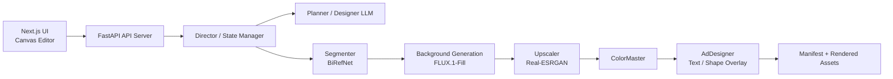

## Project Snapshot

| Item | Summary |
|------|---------|
| Problem | 제품 이미지와 입력 텍스트만으로 상세페이지용 광고 이미지를 기획부터 생성, 수정까지 이어지는 파이프라인이 필요했습니다. |
| Role | FastAPI API 계층, Director 중심 오케스트레이션, 5-stage 이미지 생성 흐름, LLM 기획 failover 구조를 기준으로 전체 동작 구조를 정리하고 포트폴리오용 설계 문서화까지 맡았습니다. |
| Stack | Next.js 14, FastAPI, Pydantic v2, FLUX.1-Fill, BiRefNet, Real-ESRGAN, Redis, Celery, OpenAI, Gemini |
| Flow | Frontend 입력 -> FastAPI 검증/라우팅 -> Director 오케스트레이션 -> Segmenter -> FluxEngine -> Upscaler -> ColorMaster -> AdDesigner -> 결과 저장/편집 |
| Outcome | 기획과 생성을 분리한 구조, 단계별 실행 시간 기록, 페이지 단위 재생성/레이어 수정 경로를 갖춘 실무형 생성 파이프라인으로 정리했습니다. |

## Architecture



## Demo Preview

<div class="project-media-grid">
  <video controls autoplay loop muted playsinline preload="metadata" style="width:100%; border-radius:12px;">
    <source src="/assets/videos/New121-web.mp4" type="video/mp4">
  </video>
  <video controls autoplay loop muted playsinline preload="metadata" style="width:100%; border-radius:12px;">
    <source src="/assets/videos/New131-web.mp4" type="video/mp4">
  </video>
  <video controls autoplay loop muted playsinline preload="metadata" style="width:100%; border-radius:12px;">
    <source src="/assets/videos/New151-web.mp4" type="video/mp4">
  </video>
</div>

## 1. 프로젝트 개요
제품 이미지와 간단한 입력 정보만으로 상세페이지용 광고 이미지를 기획하고 생성한 팀 프로젝트입니다.

핵심은 단순 이미지 생성이 아니라, 기획 문맥과 편집 흐름을 포함한 작업 파이프라인을 만드는 것이었습니다. 프로젝트는 `AI5_advanced` 소스 기준으로 Next.js 프론트엔드, FastAPI 백엔드, Director 오케스트레이션, 이미지 생성 엔진 계층으로 구성돼 있습니다.

## 2. 해결하려고 한 문제
상세페이지 제작은 보통 기획, 배경 생성, 품질 보정, 문구 배치, 수정 반복이 따로 분리되어 돌아갑니다. 이 구조에서는 다음 문제가 반복됩니다.

- 기획과 이미지 결과가 분리돼서 페이지 간 메시지 톤이 흔들림
- 배경만 수정하고 싶어도 전체를 다시 만들어야 하는 재작업 비용 발생
- 생성 단계별 병목을 계측하지 못해 최적화 우선순위를 잡기 어려움
- 단일 LLM 또는 단일 생성 흐름 실패가 전체 중단으로 연결됨

이 프로젝트는 이런 문제를 줄이기 위해 기획과 생성을 분리하고, 각 단계를 상태 기반으로 다시 실행할 수 있는 구조를 목표로 잡았습니다.

## 3. 핵심 설계 포인트

### 3-1. Director 중심 오케스트레이션
`app/api_server/main.py`에서 FastAPI 앱이 올라오면 `Director`와 `ManagerAgent`가 함께 초기화됩니다. Director는 페이지 생성 흐름 전체를 조율하고, 상태 관리와 단계 실행을 한곳에서 통제합니다.

이 구조의 장점은 생성 로직이 라우터에 흩어지지 않고, 한 객체 안에서 `초기화 -> 실행 -> 편집 -> 재생성` 흐름으로 정리된다는 점입니다.

### 3-2. 5-stage 이미지 생성 파이프라인
실제 생성 흐름은 다음 단계로 분해돼 있습니다.

1. Segmenter: 제품 누끼 및 기하 정보 추출
2. FluxEngine: 배경 생성
3. Upscaler: 결과 확대 및 품질 보정
4. ColorMaster: 색감 및 후처리
5. AdDesigner: 문구/도형/레이아웃 오버레이

이 분해가 중요한 이유는, 결과 품질 문제를 "배경 생성 문제인지", "후처리 문제인지", "텍스트 배치 문제인지" 구분할 수 있기 때문입니다.

### 3-3. 기획과 생성의 분리
프로젝트는 초기화 단계에서 manifest와 상태를 만들고, 이후 실행 단계에서 실제 페이지를 생성합니다. 이 방식은 "기획은 유지한 채 다시 생성", "특정 페이지 재생성", "레이어만 수정" 같은 작업을 가능하게 만듭니다.

실무 기준으로 보면 이 분리는 매우 중요합니다. 결과가 조금 어긋났다고 전체를 다시 돌리는 구조는 실제 운영에서 비용이 너무 큽니다.

### 3-4. LLM failover 구조
기획용 LLM 호출은 OpenAI를 우선 사용하고, 실패 시 Gemini로 넘어가는 failover 구조를 갖습니다. 생성형 워크플로우에서는 이미지 엔진 이전의 기획 단계가 막히면 전체 파이프라인이 멈추기 때문에, 이중화는 서비스 안정성 측면에서 의미가 큽니다.

### 3-5. 단계별 시간 기록과 반복 가능한 디버깅
파이프라인은 단계별 실행 시간을 기록하도록 구성되어 있어, 나중에 병목 구간을 추적할 수 있습니다. 이는 단순히 "작동한다"를 넘어서 "어디가 느리고 왜 실패하는지 설명할 수 있다"는 쪽에 가깝습니다.

## 4. 실제 코드 구조 기준 시스템 흐름

```text
사용자 입력
  -> Next.js UI
  -> FastAPI API Server
  -> Director
  -> Manager / Planner
  -> 5-stage image pipeline
  -> Manifest + Render 결과 저장
  -> Editor / Regenerate API로 후편집
```

소스 기준으로 보면:

- API 진입점: `app/api_server/main.py`
- 오케스트레이션: `core/orchestrator/director.py`
- 매니저 계층: `core/agent/manager.py`
- 라우터: `project`, `editor`, `image`, `content_generation`, `presets`, `users`

즉, 이 프로젝트는 "한 번 생성하고 끝"나는 데모보다는, 생성 이후의 수정 가능성까지 고려한 애플리케이션 구조에 더 가깝습니다.

## 5. 내가 이 프로젝트에서 강조하고 싶은 점
이 프로젝트에서 제가 중요하게 본 부분은 모델 하나의 성능이 아니라, 여러 엔진과 기획 계층을 어떻게 연결해 실무형 파이프라인으로 정리하느냐였습니다.

특히 다음 세 가지가 이 프로젝트의 핵심이라고 봅니다.

- 기획과 생성의 분리
- 단계별 상태와 시간 기록
- 페이지 단위 수정/재생성 경로 확보

이 세 가지가 있어야 실제 운영에서 장애 원인 추적과 반복 수정이 가능해집니다.

## 6. 결과와 의미
현재 구현은 "광고 이미지 생성 모델" 하나보다, 광고 제작 워크플로우를 구조화한 시스템에 가깝습니다.

결과적으로 이 프로젝트는:

- 생성 단계를 분리해 디버깅 가능한 파이프라인으로 만들고
- 페이지 단위 재생성과 후편집 경로를 확보했으며
- 기획 문맥과 이미지 생성을 같은 흐름 안에서 관리하는 방향을 제시했습니다

포트폴리오 관점에서는, 제가 단순 프롬프트 조합이 아니라 실제 서비스형 AI 파이프라인을 어떻게 바라보고 구성하는지 보여주는 프로젝트입니다.

## 7. 다음 보완 방향
- 단계별 품질 평가 지표 정리
- 페이지 역할별 결과 비교셋 추가
- 렌더링 결과에 대한 자동 QA 루프 확장
- 생성 실패/재시도 이력 시각화
