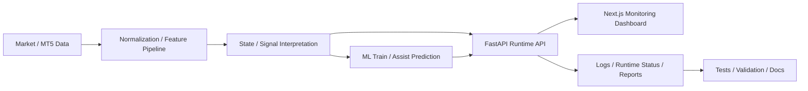

## Project Snapshot

| Item | Summary |
|------|---------|
| Problem | 시장 데이터 수집, 상태 해석, ML 보조 판단, 운영 모니터링을 따로 보면 의사결정 근거와 운영 흐름이 끊기기 쉬웠습니다. |
| Role | 기획, 구조 설계, 데이터 처리, FastAPI 백엔드, Next.js 대시보드, 테스트, 문서화까지 전 과정을 개인 프로젝트로 구현하고 정리했습니다. |
| Stack | Python 3.12, FastAPI, pandas, MetaTrader 5, Next.js 14, React 18, pytest |
| Flow | Market/MT5 데이터 수집 -> 정규화 및 상태 해석 -> 규칙 기반 판단 + ML 보조 예측 -> FastAPI runtime/trades/ops API -> Next.js 모니터링 대시보드 -> 테스트/문서/운영 점검 |
| Outcome | 데이터, 판단 로직, API, 대시보드, 문서를 하나의 시스템으로 연결해 설명 가능한 트레이딩 분석 구조를 포트폴리오 형태로 정리했습니다. |

## Architecture

## 1. 프로젝트 개요
CFD 데이터 기반 트레이딩 분석 시스템을 개인 프로젝트로 설계하고 정리한 작업입니다.

핵심은 단순 매매 자동화 스크립트가 아니라, 시장 데이터를 어떤 기준으로 가공하고 상태로 해석하며 그 판단을 어떻게 다시 검증하고 운영할 수 있는가를 하나의 시스템으로 연결하는 데 있습니다. README 기준으로 이 저장소는 데이터 처리, 규칙 기반 해석, ML 보조 예측, 운영 API, 대시보드, 테스트와 문서화까지 함께 다룹니다.

## 2. 해결하려고 한 문제
트레이딩에서는 단순히 가격이 올랐는지보다, 현재 데이터를 어떤 상태로 해석하고 있는지, 그 판단을 운영자가 어떻게 다시 확인할 수 있는지가 더 중요합니다.

이 프로젝트에서 풀고 싶었던 문제는 다음과 같습니다.

- 시장/거래 데이터를 바로 소비하면 후속 분석과 검증에 재사용하기 어려움
- 규칙 기반 판단과 ML 결과가 따로 놀면 의사결정 근거를 설명하기 어려움
- 런타임 상태, 거래 정보, 학습 반영 결과가 흩어져 있으면 운영자가 상황을 빠르게 파악하기 어려움
- 테스트와 문서가 부족하면 복잡한 구조를 바꾸거나 설명하기가 매우 어려워짐

즉, 이 프로젝트는 "수익률이 좋은 전략 하나"보다 "데이터와 판단 과정을 운영 가능한 형태로 구조화하는 시스템"에 가깝습니다.

## 3. 핵심 설계 포인트

### 3-1. 데이터 처리와 상태 해석 파이프라인
실시간으로 들어오는 시장 데이터와 거래 관련 정보를 바로 쓰지 않고, 정규화와 해석 가능한 상태 레이어를 거쳐 사용하도록 구조를 나눴습니다.

핵심 방향은 다음과 같습니다.

- 원시 데이터를 바로 소비하지 않고 중간 해석 레이어를 둠
- 심볼별 상태, 진입/대기/청산 맥락을 구조화함
- 후속 학습과 리포트에서 재사용할 수 있도록 로그와 상태를 설계함

이렇게 해야 대시보드, 검증 스크립트, ML 파이프라인이 같은 데이터를 서로 다른 목적에 맞게 재활용할 수 있습니다.

### 3-2. 규칙 기반 판단 + ML 보조 예측
이 프로젝트는 ML만으로 의사결정을 밀어붙이기보다, 규칙 기반 판단 위에 ML을 보조적으로 붙이는 방향을 택했습니다.

이 접근을 택한 이유는 다음과 같습니다.

- 트레이딩 맥락에서는 설명 가능성이 중요함
- 완전 블랙박스보다 상태 해석과 결합하는 편이 검토가 쉬움
- ML은 최종 결정보다 점수 보정, 필터링, 보조 판단에 적합함

그래서 저장소 안에는 피처 생성, 학습/평가 스크립트, 재학습 보조 파이프라인, 런타임에서의 AI 보조 판단 흐름이 함께 들어 있습니다.

### 3-3. FastAPI 운영 API와 Next.js 대시보드
운영자가 현재 상태를 바로 확인할 수 있도록 FastAPI 기반 운영 API와 Next.js 대시보드를 연결했습니다.

README와 기존 코드 설명을 함께 보면, 백엔드는 `runtime`, `trades`, `ops`, `ml` 성격의 정보를 나눠 다루고 있고, 대시보드에서는 다음과 같은 정보를 확인하도록 구성했습니다.

- 현재 런타임 상태
- 최근 거래/포지션 관련 정보
- 학습 반영 요약
- 공식 점수 보드와 운영 준비 상태

즉, "모델이 있다"에서 끝나는 것이 아니라, "실제로 운영자가 무엇을 확인하고 어떻게 상태를 해석할 수 있는가"까지 이어지는 구조입니다.

### 3-4. 테스트, 검증, 문서화까지 포함한 구조
이 저장소는 기능 구현만이 아니라, 구조를 바꾸고 설명할 수 있게 만드는 데도 초점을 두고 있습니다.

프로젝트 안에는 다음 자산이 함께 있습니다.

- 단위 테스트와 통합 테스트
- 검증용 스크립트
- 로드맵과 설계 메모
- 단계별 구현 문서와 운영 보조 문서

포트폴리오 관점에서는 이 부분이 "복잡한 코드를 어떻게 유지 가능하게 만들었는가"를 보여주는 지점이라고 생각합니다.

## 4. 저장소 구조 기준 구성

- `main.py`
  메인 런타임 진입점

- `backend/`
  도메인, 서비스, FastAPI, 핵심 애플리케이션 로직

- `adapters/`
  MT5, 알림, 관측성 등 외부 연동 어댑터

- `ports/`
  계층 분리를 위한 포트 인터페이스

- `ml/`
  피처 생성, 학습, 재학습, 평가 관련 스크립트

- `frontend/next-dashboard/`
  운영 대시보드 UI

- `scripts/`
  검증, 리포트, 배포 전 점검, 정리 작업용 스크립트

- `tests/`
  단위/통합 테스트

- `docs/`
  설계 문서, 구현 메모, 로드맵, 검증 기록

## 5. 화면 예시

### 운영 대시보드 메인 화면

런타임 상태, 운영 지표, 학습 반영 요약, 공식 점수 보드를 한 화면에서 확인할 수 있도록 구성한 대시보드입니다.

### MT5 멀티 차트 운영 화면 예시

NAS100, XAUUSD, BTCUSD를 함께 보며 시장 상태와 주요 레벨을 확인하는 실제 운영 흐름 예시입니다.

### UI 헬스 체크 / 레이아웃 미리보기

렌더링과 레이아웃 파이프라인이 정상 동작하는지 확인하기 위한 보조 화면으로, 이 프로젝트가 분석 코드만이 아니라 운영 UI까지 포함한다는 점을 보여줍니다.

## 6. 이 프로젝트에서 보여주고 싶은 역량
이 프로젝트는 아래 역량을 한 번에 보여주기 위해 구성했습니다.

- Python 기반 백엔드 설계 역량
- 데이터 전처리 및 상태 구조화 능력
- ML을 실제 시스템 안에 연결하는 감각
- FastAPI API 설계 및 운영 상태 노출 방식
- Next.js 대시보드 구성과 시각화 연결 능력
- 테스트, 검증, 문서화로 복잡도를 관리하는 습관

## 7. 현재 상태와 공개 범위
이 프로젝트는 배포 완료 서비스 소개보다, 복잡한 도메인을 데이터, ML, 시스템 설계 관점에서 어떻게 풀어냈는가를 보여주는 포트폴리오 성격이 더 강합니다.

GitHub 저장소에는 민감한 운영 자산을 제외하고 다음에 집중해 정리했습니다.

- 시스템 구조와 핵심 흐름
- 데이터 처리와 상태 해석 방식
- 운영 API와 대시보드 연결
- 테스트와 문서화 자산

실제 `.env`, 대용량 데이터, 모델 산출물, 로그 등은 제외한 버전이며, 저장소 링크는 [Sichanvisit/cfd](https://github.com/Sichanvisit/cfd) 입니다.
