## Project Snapshot

| Item | Summary |
|------|---------|
| Problem | 점수 하나로는 시장을 설명하기 어려웠고, 차트 직관과 거래 lifecycle이 데이터 구조로 남지 않으면 학습과 검증이 반복되지 않았습니다. |
| Role | state25 기획, micro-structure Top10 도입, compact schema, labeler, QA gate, backfill, runtime recycle, FastAPI와 운영 화면 정리까지 전 과정을 개인 프로젝트로 설계하고 구현했습니다. |
| Stack | Python 3.12, FastAPI, pandas, MetaTrader 5, Next.js 14, React 18, pytest |
| Flow | 1분봉 OHLCV -> Position -> Response -> State -> Forecast -> Observe / Confirm -> Entry / Wait / Exit -> Closed Result -> Teacher-State 25 + Compact Dataset |
| Outcome | 시장 해석과 거래 lifecycle을 compact dataset row로 다시 남기고, teacher-state 25와 micro-structure Top10으로 설명 가능성과 학습 가능성을 함께 확보하는 구조를 만들었습니다. |

```mermaid
flowchart LR
    A["1분봉 OHLCV / 시장 데이터"] --> B["Position (위치, 박스, 밴드, 에너지)"]
    B --> C["Response (거절, 돌파, 버팀, 실패 반응)"]
    C --> D["State (semantic state, penalties, gains)"]
    D --> E["Forecast (continuation, reversal, false-break, management forecast)"]
    E --> F["Observe / Confirm Routing"]
    F --> G["Consumer Check / Entry Gating"]
    G --> H["Entry / Wait / Exit"]
    H --> I["Closed Result / Quality Labels"]
    I --> J["Teacher-State 25 + Compact Dataset"]
```

  <strong>한 줄 요약</strong>
  
CFD는 자동매매 엔진이라기보다, 차트의 위치와 반응을 state와 forecast로 해석하고 진입, 기다림, 청산 전 과정을 compact dataset으로 남겨 다시 학습 가능한 teacher-label 데이터로 바꾸는 프로젝트입니다.

## 1. 왜 시작했는가

이 프로젝트의 문제의식은 "점수는 남지만 판단은 남지 않는다"는 데서 시작했습니다. 예전 구조는 raw score나 규칙 누적값으로 설명하기는 쉬웠지만, 실제로 사람이 차트를 읽을 때 보는 것은 점수 하나보다 훨씬 복잡한 흐름이었습니다.

- 가격이 어디에 있는지
- 그 위치에서 어떤 반응이 나왔는지
- 그 반응이 continuation인지 reversal인지
- 지금은 observe가 맞는지, confirm이 맞는지
- 진입보다 기다림이 맞는지, 기다림보다 청산이 맞는지

즉 이 프로젝트는 "수익률이 좋은 전략 하나"보다, 시장을 어떻게 해석했고 왜 들어갔고 왜 기다렸고 왜 잘랐는지를 다시 설명 가능한 데이터 구조로 남기는 문제에 더 가깝습니다.

### 1-1. 점수만으로는 시장을 설명하기 어려웠다

raw score는 남아 있어도 메인 판단축이 될 수는 없었습니다. 사람이 차트를 볼 때는 위치와 반응, 그리고 그 이후의 transition을 함께 읽기 때문입니다.

### 1-2. 차트 직관을 데이터로 남겨야 했다

사람은 1분봉을 보고도 `조용한 장`, `추세 지속장`, `브레이크아웃 직전`, `페이크아웃 반전`, `데드캣 바운스` 같은 장세를 직관적으로 읽습니다. 하지만 이 직관이 데이터로 남지 않으면 나중에 학습도 검증도 할 수 없습니다.

### 1-3. 결과만이 아니라 과정이 보여야 했다

이 프로젝트에서 중요한 것은 "손익 얼마"보다 아래 질문에 답하는 구조였습니다.

- 왜 들어갔는가
- 왜 기다렸는가
- 왜 잘랐는가
- 그 판단이 결과적으로 맞았는가

<figure class="project-media-card">
  
  <figcaption>MT5 멀티 차트 운영 화면. 이 프로젝트는 차트 직관을 점수 하나가 아니라 위치와 반응의 흐름으로 남기려는 시도에서 출발했습니다.</figcaption>
</figure>

## 2. 이 프로젝트를 어떤 구조로 생각했는가

이 프로젝트를 소개할 때 중요한 점은 "룰을 더 많이 만든 프로젝트"가 아니라, 이미 있는 엔진을 사람이 이해하는 state와 학습 가능한 데이터로 재정렬한 프로젝트라는 점입니다.

- raw score는 남아 있어도 메인 판단축이 아님
- 메인 판단은 `position -> response -> state -> forecast` 에 가까움
- teacher-state는 이 구조 위에 사람이 이해하는 패턴 라벨을 얹는 층

즉 이 프로젝트는 `시장 해석`, `거래 lifecycle 기록`, `학습 가능한 compact dataset 생성`을 같이 만드는 쪽에 가깝습니다.

## 3. 기획 -> 생성 -> 수정

### 3-1. 기획

기획 단계에서 먼저 고정한 축은 아래 다섯 가지였습니다.

1. `teacher-state 25`
2. `micro-structure Top10`
3. `compact schema`
4. `labeling QA`
5. `experiment tuning`

철학도 명확했습니다.

- 새 엔진을 처음부터 만드는 것이 아니라 기존 `position / state / forecast` 구조를 활용한다
- raw 전체를 오래 쌓기보다 학습 가능한 compact row로 남긴다

### 3-2. 생성

생성 단계에서는 `micro-structure Top10`을 실제 시스템 파이프라인에 심었습니다.

- `body_size_pct_20`
- `upper_wick_ratio_20`
- `lower_wick_ratio_20`
- `doji_ratio_20`
- `direction_run_stats`
- `range_compression_ratio_20`
- `volume_burst_decay_20`
- `swing_high_retest_count_20`
- `swing_low_retest_count_20`
- `gap_fill_progress`

이 10개는 새 지표를 더 붙이는 일이 아니라, "차트 모양 자체"를 숫자로 남기기 위한 canonical micro-structure state입니다.

실제 구현은 아래 순서로 진행됐습니다.

1. OHLCV helper
2. `StateRawSnapshot` 편입
3. state vector / forecast harvest
4. `entry_decisions.csv` hot payload 연결
5. `trade_closed_history.csv` compact bridge 연결
6. regression bundle 구축
7. teacher-state casebook bridge 구축
8. `teacher_pattern_*` compact schema 구축
9. rule-based labeler 구축
10. QA gate 구축
11. bounded / richer backfill 구축

### 3-3. 수정

수정 단계에서는 "만들었다"에서 끝내지 않고, 실제 데이터에 붙여본 뒤 계속 보정했습니다.

- `payload flatness` 문제 보정
- `entry_atr_ratio_flat` 문제 해소
- bounded backfill과 richer backfill 분리
- confusion pair 관측과 튜닝
- execution handoff를 gate 방식으로 관리
- 장시간 runtime drift 가능성을 운영 가설로 분리

핵심은 모델을 한 번 학습시키는 것이 아니라, 라벨링과 운영 판단이 계속 설명 가능하게 유지되도록 보정 루프를 만드는 것이었습니다.

## 4. 현재 어디까지 왔는가

현재 상태는 "기초 공사"를 넘어서, 실제 labeled row를 누적하면서 coverage와 support를 확장하는 단계에 있습니다.

  

    <strong>Total Closed Rows</strong>
    8705 rows
  

  

    <strong>Labeled Rows</strong>
    2596 rows
  

  

    <strong>QA Gate</strong>
    PASS_WITH_WARNINGS
  

  

    <strong>Supported Patterns</strong>
    1, 5, 9, 11, 14, 21, 25
  

현재 기준 요약:

- `micro-structure Top10` 구축 완료
- `teacher_pattern_* compact schema` 구축 완료
- `state25 rule-based labeler` 구축 완료
- `Step 8 labeling QA gate` 구축 완료
- `bounded backfill + richer detail micro backfill` 적용 완료
- `Step 9-E1~E5` 틀과 리포트 구축 완료
- 현재는 `labeler retune + tuned relabel + E1/E2/E3 재실행` 이후 `E5` 재확인 게이트와 runtime 장기 관찰 단계

현재 labeled rows의 심볼 분포는 다음과 같습니다.

- `BTCUSD`: `785`
- `XAUUSD`: `1030`
- `NAS100`: `781`

현재 관측된 primary pattern은 `1, 5, 9, 11, 12, 14, 21, 25`이고, 현재 pilot baseline supported pattern은 `1, 5, 9, 11, 14, 21, 25`입니다.

현재 남아 있는 경고는 다음 세 가지입니다.

- `unlabeled_rows_present`
- `rare_pattern_watch_triggered`
- `low_confidence_review_required`

즉 지금 단계의 핵심은 "엔진을 다시 만들기"가 아니라, `10K seed 확장`, `watchlist pair 관찰`, `runtime long-run drift 관찰`을 통해 구조를 더 현실화하는 데 있습니다.

## 5. 무엇을 실제로 만들었는가

이 프로젝트에서 실제로 구현하고 묶은 것은 아래와 같습니다.

- 1분봉 OHLCV를 micro-structure Top10으로 승격하는 helper와 state raw snapshot
- `position -> response -> state -> forecast` 를 유지한 채 lifecycle을 compact dataset row로 연결하는 bridge
- `teacher_pattern_*` compact schema
- `state25` rule-based labeler
- labeling QA gate
- bounded backfill과 richer detail micro backfill
- guarded runtime recycle과 `log_only` 관찰 경로
- 운영자가 현재 상태를 해석할 수 있는 API와 dashboard

채용 관점에서 중요한 포인트는, 이 프로젝트가 단순히 트레이딩 신호를 더 많이 만드는 작업이 아니라, 시장 해석과 거래 lifecycle 자체를 데이터 구조로 바꾸는 작업이라는 점입니다.

## 6. 운영 화면과 발표용 시각 자료

### 공개된 운영 화면

  <figure class="project-media-card">
    
    <figcaption>Dashboard home. runtime 상태, 운영 지표, 학습 반영 요약, 공식 점수 보드를 한 화면에서 확인할 수 있도록 구성한 현재 운영 화면입니다.</figcaption>
  </figure>
  <figure class="project-media-card">
    
    <figcaption>UI health check. 분석 코드만이 아니라 운영 UI와 레이아웃 파이프라인까지 포함한 시스템이라는 점을 보여주는 보조 화면입니다.</figcaption>
  </figure>

### 지금 발표에서 보여주기 좋은 핵심 지표

현재 단계에서 가장 설득력 있는 지표는 수익률보다 아래 두 가지입니다.

1. `Teacher-Pattern Coverage`
   시장 상태를 얼마나 넓게 읽기 시작했는지 보여주는 지표입니다.
2. `Activation Funnel / Why Blocked`
   신호가 어떻게 진입까지 이어지거나 막히는지 보여주는 지표입니다.

한 줄로 말하면, 이 프로젝트는 "거래를 많이 하는 엔진"보다 "시장을 점점 더 넓게 읽고 기록하는 엔진"에 가깝습니다.

### 운영 화면 1장 구상

가장 만들고 싶은 운영 화면은 `CFD Lifecycle Intelligence Board` 입니다. 이 화면은 아래 네 구역으로 구성하는 것이 가장 자연스럽습니다.

| 영역 | 내용 | 데이터 소스 |
|---|---|---|
| 좌상단 | Activation funnel | `entry_decisions.csv` |
| 우상단 | Teacher-pattern coverage | `trade_closed_history.csv` |
| 좌하단 | Top blocked reasons / observe reasons | `entry_decisions.csv` |
| 우하단 | Wait / exit quality mix | `trade_closed_history.csv` |

이 보드는 단순 결과 화면이 아니라, 왜 활성화되었고 어디서 막혔으며 어떤 state가 쌓였는지를 한 번에 보여주는 시각화입니다.

## 7. 이 프로젝트에서 보여주고 싶은 역량

- 차트 직관을 state와 lifecycle 데이터 구조로 바꾸는 능력
- rule / state / forecast 기반 시스템을 학습 가능한 compact dataset으로 재정렬하는 능력
- micro-structure, labeler, QA gate, backfill을 하나의 데이터 제품 흐름으로 묶는 능력
- 설명 가능성과 학습 가능성을 동시에 고려하는 머신러닝 관점
- FastAPI, 운영 API, dashboard를 통해 판단 근거를 화면으로 연결하는 능력
- 테스트, 문서화, handoff 문서로 복잡도를 관리하는 습관

## 8. 한계와 다음 단계

이 프로젝트는 "완성됐다"고 과장하는 프로젝트보다, 구조를 만들고 붙이고 검증하고 운영으로 넘기는 프로젝트로 소개하는 쪽이 더 정확합니다.

현재 한계:

- 25개 패턴 전체를 아직 다 커버하지는 못함
- rare pattern은 시장 특성상 느리게 쌓임
- execution handoff는 gate를 두고 보수적으로 진행 중
- 장시간 runtime drift 가능성은 운영 가설로 분리해 관찰 중

다음 단계:

- labeled seed를 더 넓게 확장
- watchlist pair를 충분히 관찰
- E5 재확인 타이밍 관리
- coverage / activation / quality mix를 운영 화면으로 시각화

## 9. 마무리 한 줄

CFD는 자동매매 프로젝트가 아니라, 시장 해석을 데이터 구조로 바꾸고 거래 lifecycle을 학습 가능한 teacher-label 데이터로 남기는 프로젝트라고 소개하는 것이 가장 정확합니다.
