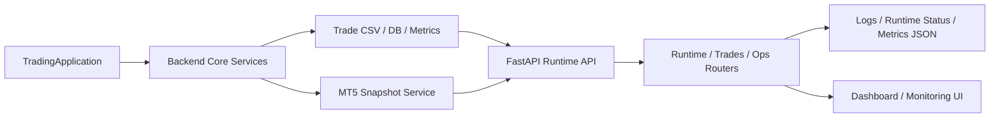

## Project Snapshot

| Item | Summary |
|------|---------|
| Problem | CFD 자동매매/운영 환경에서 거래 실행 로직과 관측성, 운영 제어 API를 분리해 점검할 수 있는 구조가 필요했습니다. |
| Role | TradingApplication 진입점, FastAPI 운영 서버, runtime/trades/ops 계층, CSV/metrics/runtime 상태 파일을 사용하는 관측성 구조를 기준으로 현재 시스템 구성을 정리했습니다. |
| Stack | Python, FastAPI, Pandas, Uvicorn, logging, file-based observability, Next.js dashboard |
| Flow | TradingApplication 실행 -> backend 서비스 조합 -> MT5/CSV 상태 수집 -> FastAPI runtime/trades/ops API -> 로그/메트릭/상태 파일 갱신 -> 운영 UI/분석 |
| Outcome | 현재는 실험 및 운영 정리 단계지만, 거래 기록/런타임 상태/운영 문서를 분리해 관측성과 운영 제어를 확장 가능한 형태로 가져가고 있습니다. |

## Architecture

## 1. 프로젝트 개요
CFD 자동매매 환경을 운영 가능한 구조로 정리하기 위해 만든 실험 프로젝트입니다.

이 프로젝트는 단순 전략 코드보다, 실행 중인 시스템을 어떻게 관측하고 제어할 것인가에 더 초점을 둡니다. 현재 코드 기준으로는 `TradingApplication`이 진입점 역할을 하고, 백엔드에는 FastAPI 기반 운영 API, 거래 이력 분석, 런타임 상태 기록, 로그 및 메트릭 관리가 분리되어 있습니다.

## 2. 해결하려고 한 문제
자동매매 시스템은 전략이 잘 도는지뿐 아니라, 운영 중에 무슨 일이 일어나고 있는지를 빠르게 확인할 수 있어야 합니다.

이 프로젝트에서 다루는 핵심 문제는 다음과 같습니다.

- 거래 실행과 운영/모니터링 코드가 섞이면 장애 원인 추적이 어려움
- 런타임 상태가 파일, 로그, 메트릭에 흩어져 있으면 운영자가 상황을 빠르게 파악하기 어려움
- MT5 스냅샷, 거래 CSV, 모델 메트릭이 각각 따로 존재하면 한 화면에서 상태를 보기 어려움
- 운영 정책과 알림 기준이 코드와 문서에 동시에 정리돼 있지 않으면 유지보수가 불안정해짐

즉, 이 프로젝트는 "전략 자체의 수익률"보다 "운영 가능한 자동매매 시스템의 뼈대"를 만드는 데 가깝습니다.

## 3. 실제 코드 구조 기준 설계

### 3-1. 실행 진입점 분리
루트의 `main.py`는 `TradingApplication().run()`을 실행합니다. 이 방식은 실행 진입점을 하나로 고정해, 나중에 서비스 전체 부팅 순서를 정리하기 쉽게 만듭니다.

### 3-2. FastAPI 운영 API 계층
`backend/fastapi/app.py` 기준으로 보면 FastAPI 앱은 lifespan에서 구성 요소를 조립하고, 런타임 서비스들을 `app.state`에 올립니다. 여기에는 다음 성격의 API 계층이 분리돼 있습니다.

- `runtime`: 현재 상태 점검
- `trades`: 거래 이력/기본 조회
- `ml`: 모델 관련 조회
- `ops`: 운영 제어 및 정책 관점 엔드포인트

이 구조는 나중에 프론트 대시보드가 붙더라도, 각 API의 책임이 비교적 명확하게 유지된다는 장점이 있습니다.

### 3-3. 파일 기반 관측성 구조
현재 프로젝트는 완전한 외부 관측 플랫폼 대신, 파일 기반 관측성 구조를 먼저 잡고 있습니다.

코드에 명시된 주요 경로는 다음과 같습니다.

- `data/trades/trade_history.csv`
- `models/metrics.json`
- `models/deploy_state.json`
- `data/runtime_status.json`
- `data/logs/fastapi.log`

이 구조는 초기 단계에서 특히 유용합니다. 시스템이 아직 자주 바뀌는 동안에는 외부 인프라보다, 상태를 빠르게 읽고 기록할 수 있는 단순한 저장 방식을 먼저 갖추는 편이 개발 속도와 디버깅 효율에 유리합니다.

### 3-4. MT5 스냅샷과 거래 데이터 연계
FastAPI 앱의 lifespan 안에서 MT5 snapshot background loop가 시작되고, 거래 CSV와 함께 운영 상태를 구성합니다.

즉, 이 프로젝트는 정적 분석 도구가 아니라:

- 실시간 또는 주기적 상태 수집
- 거래 이력 조회
- 메트릭/런타임 상태 기록
- 운영자용 API 제공

을 함께 다루는 구조입니다.

## 4. 이 프로젝트에서 보여주고 싶은 점
이 프로젝트는 "자동매매 전략 하나 만들었다"는 이야기보다, 운영 가능한 시스템을 만들기 위해 무엇을 먼저 분리해야 하는지를 보여주는 쪽에 더 가깝습니다.

제가 중요하게 본 부분은 다음과 같습니다.

- 실행 진입점과 서비스 조립 지점 분리
- 관측성 데이터 경로 명시
- 운영 API와 거래 API 분리
- 문서와 로그 경로를 코드 안에서 함께 관리하는 방식

즉, 아직 정리 단계이지만 시스템을 운영 가능한 형태로 확장하려는 구조적 사고를 담고 있습니다.

## 5. 현재 상태와 한계
이 프로젝트는 다른 두 포트폴리오 프로젝트처럼 완성된 서비스보다, 운영/관측 구조를 정리해 가는 실험 프로젝트에 가깝습니다.

현재 한계는 분명합니다.

- README와 외부 문서 정리가 부족함
- 결과 지표가 포트폴리오용으로 충분히 정제되지 않음
- 실행 흐름과 운영 화면의 연결을 더 명확히 보여줄 자료가 부족함

그래서 이 페이지는 과장된 성과보다, 현재 구현된 구조와 다음 정리 방향을 솔직하게 보여주는 쪽으로 정리했습니다.

## 6. 다음 보완 방향
- 실행 가이드 및 로컬 재현 절차 정리
- 운영 대시보드 화면과 API 흐름 연결
- 런타임/거래/메트릭 핵심 지표를 시각화한 결과 섹션 추가
- 문서와 코드 간 용어 정합성 정리
