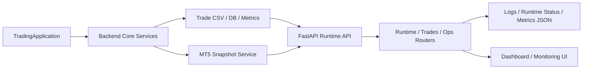

## Project Snapshot

| Item | Summary |
|------|---------|
| Problem | CFD 자동매매/운영 환경에서 거래 실행 로직과 관측성, 운영 제어 API를 분리해 점검할 수 있는 구조가 필요했습니다. |
| Role | TradingApplication 진입점, FastAPI 운영 서버, runtime/trades/ops 계층, CSV/metrics/runtime 상태 파일을 사용하는 관측성 구조를 기준으로 현재 시스템 구성을 정리했습니다. |
| Stack | Python, FastAPI, Pandas, Uvicorn, logging, file-based observability, Next.js dashboard |
| Flow | TradingApplication 실행 -> backend 서비스 조합 -> MT5/CSV 상태 수집 -> FastAPI runtime/trades/ops API -> 로그/메트릭/상태 파일 갱신 -> 운영 UI/분석 |
| Outcome | 현재는 실험 및 운영 정리 단계지만, 거래 기록/런타임 상태/운영 문서를 분리해 관측성과 운영 제어를 확장 가능한 형태로 가져가고 있습니다. |

## Architecture

## 1) 프로젝트 개요
CFD 관련 학습과 구현 실험을 정리 중인 프로젝트입니다.

## 2) 현재 상태
- 소스 코드 분류 진행
- 실험 목적과 결과 문서화 진행

## 3) 다음 계획
- 실행 가이드 및 결과 지표 보강
- GitHub 원격 저장소 연결
