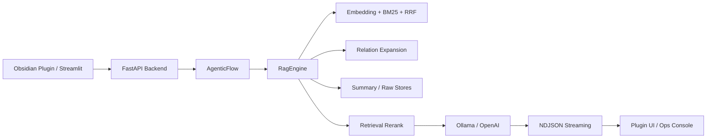

## Project Snapshot

| Item | Summary |
|------|---------|
| Problem | Obsidian 안에서 실제로 쓰기 좋은 로컬 RAG를 만들고 싶었지만, 1차 버전은 Streamlit 중심 실험형 UI에 가까워 실제 노트 작업 흐름과는 거리가 있었습니다. |
| Role | FastAPI 백엔드, AgenticFlow 기반 검색/생성 흐름, relation-aware retrieval, Streamlit 운영 콘솔, Obsidian 플러그인 통합까지 직접 설계하고 구현했습니다. |
| Stack | Python, FastAPI, Streamlit, TypeScript, Obsidian Plugin API, ChromaDB, BM25, Ollama, OpenAI |
| Flow | Obsidian Plugin 또는 Streamlit -> FastAPI -> AgenticFlow -> RagEngine(hybrid retrieval + relation expansion + rerank) -> LLM -> NDJSON Streaming |
| Outcome | Streamlit 단일 UI에서 Obsidian 플러그인 중심 워크플로우로 확장했고, 현재 노트 문맥과 relation graph를 활용하는 2차 버전으로 고도화했습니다. |

## Architecture

## 1. 프로젝트 개요

이 프로젝트는 Obsidian에 쌓인 개인 문서와 학습 노트를 대상으로 질문, 근거, 답변 흐름을 만드는 로컬 RAG 시스템입니다.

1차 버전에서는 FastAPI와 Streamlit을 중심으로 검색과 답변 생성 파이프라인을 만들었고, summary/raw 이중 저장소와 하이브리드 검색 구조를 정리하는 데 집중했습니다. 하지만 실제 사용 맥락은 Streamlit보다 Obsidian 안에서 노트를 읽고 질문을 던지고, 연결된 문서를 확인하고, 답변을 다시 노트로 저장하는 쪽에 더 가까웠습니다.

그래서 2차 업데이트에서는 단순히 검색 품질만 높이는 것이 아니라, 사용 흐름 자체를 Obsidian 중심으로 옮기는 방향으로 구조를 다시 잡았습니다.

## 2. 왜 2차 업데이트가 필요했는가

1차 버전은 기술 실험과 파이프라인 정리에 의미가 있었지만 실제 사용에서는 몇 가지 한계가 분명했습니다.

- 현재 작업 중인 노트 문맥을 자연스럽게 붙이기 어렵고, 질문과 노트 사이 연결이 느슨했습니다.
- 검색 결과가 왜 선택되었는지 UI에서 빠르게 확인하기 어려웠습니다.
- Generator, Tagger, Ingest 같은 운영 작업이 Streamlit 안에 묶여 있어 클라이언트가 바뀌면 재사용이 어려웠습니다.
- 노트 사이 관계 정보가 있어도 검색 단계에서는 충분히 활용하지 못했습니다.

이 문제를 해결하려면 단순히 모델을 바꾸는 것이 아니라, 클라이언트 구조, 검색 로직, 운영 인터페이스를 함께 손봐야 했습니다.

## 3. 이번에 바뀐 핵심

### 3-1. Obsidian 플러그인을 메인 클라이언트로 추가

이번 버전에서 가장 큰 변화는 Obsidian 플러그인을 별도 클라이언트로 붙인 점입니다.

- 현재 노트를 읽고 질문 내용에 따라 필요한 경우에만 첨부하는 question-first 흐름을 넣었습니다.
- 링크, 같은 폴더, 태그, 백링크를 문맥 후보로 수집할 수 있게 했습니다.
- 답변 패널에서 검색된 소스와 전송된 문맥 노트를 카드 형태로 보고 바로 열 수 있습니다.
- 답변을 새 노트로 저장하거나 현재 노트에 이어붙일 수 있습니다.

이 변화 덕분에 RAG가 별도 데모 화면이 아니라 실제 Obsidian 작업 흐름 안으로 들어오게 됐습니다.

### 3-2. relation-aware retrieval 도입

검색 쪽에서는 typed relation과 related files 메타데이터를 활용하는 relation-aware retrieval을 추가했습니다.

- 노트 메타데이터에서 relation adjacency를 구성합니다.
- direct match뿐 아니라 1-hop, 2-hop 관계 체인도 확장 후보로 봅니다.
- relation type, confidence, direction을 반영해 체인 점수를 계산합니다.
- 검색 결과에는 `retrieval_reason`, `source_type`, relation chain 설명을 함께 내려서 UI에서 왜 선택됐는지 확인할 수 있게 했습니다.

기존 하이브리드 검색이 문서 후보를 잘 모으는 역할이었다면, 이번 relation-aware 흐름은 직접 매칭되지 않는 구현 문서나 후속 노트를 더 안정적으로 끌어오는 역할을 담당합니다.

### 3-3. Generator / Tagger / Ingest를 공통 API로 재구성

운영 작업도 구조를 바꿨습니다.

- `/api/tools/config`
- `/api/tools/files`
- `/api/tools/generator/stream`
- `/api/tools/tagger/stream`
- `/api/tools/ingest/stream`

이렇게 API 계층을 분리해 Streamlit 운영 콘솔과 Obsidian 플러그인이 같은 백엔드 도구를 공유하도록 만들었습니다. 덕분에 클라이언트가 달라도 핵심 워크플로우는 한 번만 구현하면 되는 구조가 됐습니다.

### 3-4. 로컬 실행 안정성 보강

실행 경험도 함께 손봤습니다.

- `.env`와 경로 로더를 정리해 Vault 위치를 자동 탐지하도록 보강했습니다.
- 기본 로컬 모델을 `qwen3.5:4b` 기준으로 정리했습니다.
- `start_rag.bat`가 백엔드 헬스체크 후 기존 프로세스를 재사용하거나 재기동합니다.

이런 부분은 겉으로는 작아 보여도, 로컬 프로젝트를 매일 쓰는 관점에서는 꽤 큰 생산성 차이를 만듭니다.

## 4. 구현 포인트

### 4-1. 질문 우선 문맥 결합

현재 노트를 무조건 붙이면 잡음이 늘어납니다. 그래서 질문이 현재 노트를 참조하는 경우에만 우선 첨부하고, 나머지 문맥은 링크, 폴더, 태그, 백링크 기준으로 선택적으로 확장하는 구조를 택했습니다.

### 4-2. 검색 결과를 설명 가능한 형태로 반환

좋은 검색만큼 중요한 것이 "왜 이 문서가 선택됐는지" 보여주는 UX라고 판단했습니다. 그래서 단순 문서 목록 대신 source layer, score, snippet, retrieval reason을 구조화해 내려주고, 플러그인과 Streamlit에서 이를 바로 보여주도록 했습니다.

### 4-3. 제품 클라이언트와 운영 콘솔의 역할 분리

이번 버전에서는 Streamlit을 버린 것이 아니라 역할을 재정의했습니다.

- Obsidian Plugin: 실제 사용 흐름
- Streamlit: 운영 콘솔, 디버깅, 수동 워크플로우 실행

이 분리는 개인 프로젝트에서도 꽤 중요했습니다. 기능이 늘어날수록 사용 화면과 운영 화면이 분리되어야 구조가 덜 흔들리기 때문입니다.

## 5. 결과와 배운 점

이번 업데이트를 통해 Obsidian RAG는 단순한 로컬 검색 데모에서, 실제 노트 작업 흐름 안으로 들어가는 워크스페이스에 가까워졌습니다.

특히 크게 배운 점은 세 가지였습니다.

- 검색 품질 개선만으로는 충분하지 않고, 사용 맥락에 맞는 클라이언트 구조가 함께 필요합니다.
- RAG에서는 "정답을 잘 찾는 것"만큼 "왜 찾았는지 설명하는 것"이 중요합니다.
- 로컬 프로젝트일수록 경로 설정, 기동 안정성, 운영 도구 인터페이스 같은 비기능 요소가 체감 완성도를 크게 좌우합니다.

## 6. 다음 단계

- relation scoring과 retrieval 평가셋을 더 정교하게 다듬기
- 플러그인 대화 히스토리와 추천 액션 UX 개선
- Generator, Tagger, Ingest 결과를 더 명확하게 시각화하는 운영 대시보드 보강
