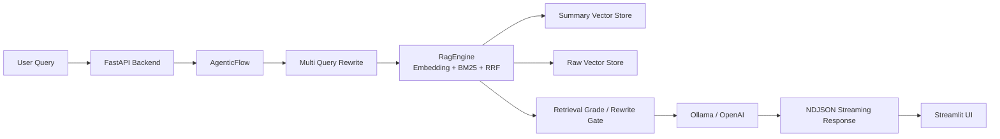

## Project Snapshot

| Item | Summary |
|------|---------|
| Problem | 로컬 Obsidian 지식베이스를 대상으로, 근거가 추적되고 재검색/재작성 루프를 제어할 수 있는 실무형 RAG 시스템이 필요했습니다. |
| Role | FastAPI + Streamlit 구조, AgenticFlow 검색/재작성 흐름, summary/raw 이중 저장소, BM25 + 벡터 + RRF 하이브리드 검색 구조를 기준으로 파이프라인을 설계하고 정리했습니다. |
| Stack | Python, FastAPI, Streamlit, ChromaDB, sentence-transformers, BM25, RRF, Ollama, OpenAI |
| Flow | User Query -> FastAPI /api/chat/stream -> AgenticFlow(Think/Search/Grade/Rewrite/Generate/Review) -> RagEngine(summary/raw 검색) -> LLM -> NDJSON Streaming -> Streamlit UI |
| Outcome | 다중 질의 검색, 품질 게이트, 반복 응답 차단, 출처 보강, 로컬 실행 스택까지 포함한 Agentic RAG 구조를 일관된 서비스 형태로 정리했습니다. |

## Architecture



## 1. 프로젝트 개요
Obsidian에 쌓아 둔 개인 문서와 학습 노트를 대상으로, 근거 기반 답변을 제공하는 로컬 RAG 시스템입니다.

이 프로젝트는 단순한 "벡터 검색 + 답변 생성" 조합이 아니라, 검색 품질이 낮을 때 재작성과 재검색을 다시 수행하는 Agentic RAG 흐름을 목표로 설계했습니다. 실제 구현은 FastAPI 백엔드와 Streamlit 프론트엔드로 나뉘며, `/api/chat/stream`을 통해 NDJSON 스트리밍 응답을 제공합니다.

## 2. 해결하려고 한 문제
Obsidian 기반 개인 지식 저장소는 양이 많아질수록 검색 품질 문제가 빠르게 드러납니다.

- 짧은 질의는 의도가 약해 필요한 문서를 놓치기 쉽습니다
- 벡터 검색만 쓰면 키워드 힌트가 강한 질문에서 흔들립니다
- BM25만 쓰면 의미 기반 질의를 잘 못 잡습니다
- 검색 품질이 낮은데도 생성 단계가 그대로 진행되면, 근거 약한 장문 응답이 나옵니다
- 스트리밍 생성 중 반복 루프가 생기면 응답 품질이 급격히 떨어집니다

이 프로젝트는 이 다섯 가지를 줄이는 방향으로 구성됐습니다.

## 3. 핵심 설계 포인트

### 3-1. Multi Query 기반 질의 확장
질문 하나만으로 검색하지 않고, 재작성 질의와 분해 질의를 함께 생성한 뒤 상위 몇 개 질의를 실제 검색에 사용합니다.

이 접근은 "질문은 짧은데 실제 의도는 긴 경우"에 특히 유리합니다. 예를 들어 프로젝트명, 개념어, 구현 관점이 섞여 있는 질문은 질의 확장을 하지 않으면 검색 누락이 자주 발생합니다.

### 3-2. Summary + Raw 이중 저장소
저장소를 요약 컬렉션과 원문 컬렉션으로 나눠 관리합니다.

- summary 저장소: 빠른 회수와 질의 확장 대응
- raw 저장소: 실제 근거 문장 확인과 세부 인용 보강

이 구조는 회수율과 근거 추적성 사이의 균형을 잡기 위한 선택입니다. 요약만 쓰면 근거가 빈약해지고, 원문만 쓰면 검색 비용과 잡음이 커집니다.

### 3-3. 하이브리드 검색과 RRF 결합
검색 단계에서는 임베딩 검색과 BM25 검색을 함께 수행하고, 결과를 RRF로 합칩니다.

이렇게 하면:

- 의미 기반 질의는 벡터 검색이 받고
- 파일명/키워드 힌트가 강한 질의는 BM25가 보완하며
- 최종 후보는 두 신호를 합친 순위로 정리됩니다

개인 지식베이스처럼 문서 스타일이 균일하지 않은 환경에서는 이 혼합 구조가 단일 검색기보다 훨씬 안정적입니다.

### 3-4. 검색 품질 게이트
검색 결과가 좋지 않으면 바로 답변을 생성하지 않고, 재작성 또는 재검색으로 분기합니다.

이 게이트는 RAG 시스템에서 중요합니다. 검색이 약한 상태에서 생성만 잘하게 만들면, 결국 답변 품질보다 환각이 먼저 늘어납니다. 이 프로젝트는 검색 단계에서 품질 기준을 두고, 실패 시 다시 검색하도록 설계했습니다.

### 3-5. 반복 응답 차단과 출처 보강
스트리밍 응답이 길어질 때는 반복 패턴을 감지해 임계치를 넘기면 절단합니다. 또한 답변에 출처 태그가 누락되면 후처리 단계에서 출처 보강을 시도합니다.

즉, 생성은 끝난 뒤에도 그대로 방치하지 않고, 최소한의 품질 방어 장치를 추가한 구조입니다.

## 4. 실제 코드 구조 기준 시스템 흐름

```text
User Query
  -> FastAPI /api/chat/stream
  -> AgenticFlow
     -> Think
     -> Search
     -> Grade
     -> Rewrite
     -> Generate
     -> Review
  -> RagEngine
     -> Summary Search
     -> Raw Expansion
     -> BM25 + Embedding + RRF
  -> LLM
  -> NDJSON Streaming
  -> Streamlit UI
```

소스 기준 주요 위치는 다음과 같습니다.

- 백엔드 진입점: `backend/main.py`
- 파이프라인 코어: `backend/src/graph`, `backend/src/rag`
- 프론트엔드: `frontend/app.py`
- 실행/배포: `start_rag.bat`, `docker-compose.yml`

즉, 이 프로젝트는 실험 코드가 아니라 로컬에서 직접 실행 가능한 작은 서비스 구조로 정리돼 있습니다.

## 5. 이 프로젝트에서 보여주고 싶은 역량
이 프로젝트는 제가 RAG를 "검색 한 번 + LLM 호출 한 번"으로 보지 않는다는 점을 보여줍니다.

제가 여기서 중요하게 본 것은:

- 검색 품질을 먼저 제어하는 구조
- 재작성/재검색 루프가 있는 에이전틱 흐름
- 근거와 출처를 끝까지 유지하려는 설계
- 로컬 환경에서도 실행 가능한 운영 형태

즉, 모델 하나보다 파이프라인 전체를 설계하는 관점을 드러내는 프로젝트입니다.

## 6. 결과와 의미
결과적으로 이 프로젝트는 다음을 갖춘 개인 지식 검색 시스템으로 정리됐습니다.

- 하이브리드 검색
- 이중 저장소
- 품질 게이트
- 반복 차단
- NDJSON 스트리밍 응답
- FastAPI + Streamlit 실행 구조

포트폴리오 관점에서는 "RAG를 실제 서비스 구조로 끌고 간 경험"을 보여주는 대표 프로젝트입니다.

## 7. 다음 보완 방향
- 평가셋 기반 RAGAS 정량 검증
- 재검색 루프 정책 세분화
- 문서 태그 기반 검색 필터링 강화
- 프로젝트별 검색 성능 비교 대시보드 추가
