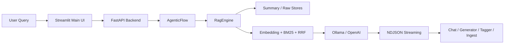

## Project Snapshot

| Item | Summary |
|------|---------|
| Problem | Obsidian 개인 문서를 검색 가능한 지식 자산으로 바꾸고, 근거 기반 응답과 운영 작업을 하나의 로컬 UI에서 다루는 흐름이 필요했습니다. |
| Role | FastAPI 스트리밍 백엔드, Streamlit 메인 채팅 UI, summary/raw 이중 저장소, 하이브리드 검색, 인덱싱/태깅 운영 흐름, 테스트와 문서화를 직접 구현했습니다. |
| Stack | Python 3.12, FastAPI, Streamlit, ChromaDB, BM25, RRF, LangChain, Ollama, OpenAI |
| Flow | User Query + Project Context -> FastAPI `/api/chat/stream` -> AgenticFlow -> RagEngine(summary/raw + hybrid retrieval) -> LLM -> NDJSON Streaming -> Streamlit UI |
| Outcome | Streamlit 하나로 질문 응답, 인덱싱, 태깅, 품질 점검까지 다룰 수 있는 end-to-end 로컬 RAG 프로토타입을 정리했습니다. |

## Architecture

## 1. 프로젝트 개요

`Obsidian RAG V1`은 Obsidian 문서를 단순 보관 대상이 아니라, 검색과 질의응답이 가능한 로컬 지식 기반으로 바꾸는 데서 출발한 1차 버전입니다.

이 단계의 핵심은 "개인 노트 저장소를 실제로 질의 가능한 시스템으로 만들 수 있는가"였습니다. 그래서 FastAPI 백엔드, Streamlit 메인 UI, 하이브리드 검색 파이프라인, 인덱싱과 태깅 흐름을 한 번에 묶어 end-to-end 흐름을 직접 구현했습니다.

현재 저장소의 `main` 브랜치 기준 구현은 [Obsidian RAG V2]({{ '/portfolio/obsidian-rag2/' | relative_url }}) 쪽이지만, V1은 검색과 스트리밍 응답, 운영 UI를 처음 서비스 형태로 정리한 버전이라는 점에서 별도 아카이브 가치가 있다고 판단해 분리했습니다.

## 2. 해결하려고 한 문제

Obsidian에 문서가 쌓여도, 실제로 질문 가능한 지식 자산이 되려면 몇 가지 문제가 먼저 풀려야 했습니다.

- 문서를 검색해서 답변하는 흐름이 로컬 환경에서 안정적으로 돌아야 했습니다.
- 벡터 검색 하나만으로는 짧은 질의나 키워드 중심 질문에서 누락이 잦았습니다.
- 채팅만 있는 데모가 아니라 인덱싱, 태깅, 점검 작업까지 한 화면에서 관리할 필요가 있었습니다.
- 답변 생성이 길어질수록 반복 응답, 출처 누락, 검색 품질 저하 같은 문제가 더 크게 드러났습니다.

이 버전은 이 문제들을 줄이기 위해, 검색과 생성뿐 아니라 운영 흐름까지 함께 설계한 로컬 RAG 워크스페이스에 가깝습니다.

## 3. 핵심 설계 포인트

### 3-1. FastAPI 기반 스트리밍 RAG 백엔드
질문은 `/api/chat/stream` 으로 들어오고, 단계 로그와 답변을 NDJSON 형태로 스트리밍합니다.

백엔드에서는 `Think -> Search -> Grade -> Rewrite -> Generate -> Review` 흐름을 분리해, 검색 품질이 낮으면 재작성과 재검색이 가능하도록 구조를 잡았습니다.

### 3-2. summary/raw 이중 저장소와 하이브리드 검색
문서를 요약 저장소와 원문 저장소로 분리해 역할을 나눴습니다.

- summary 저장소는 빠른 회수와 질의 확장 대응에 집중합니다.
- raw 저장소는 실제 근거 문장과 세부 내용을 보강하는 데 사용합니다.
- dense retrieval, BM25, RRF를 함께 써서 의미 기반 질의와 키워드 기반 질의를 모두 받도록 했습니다.

이 선택 덕분에 "짧은 질문인데 의도는 긴 경우"와 "파일명/개념 키워드가 중요한 질문"을 더 안정적으로 처리할 수 있었습니다.

### 3-3. Streamlit을 메인 사용 화면이자 운영 콘솔로 사용
V1에서는 Streamlit이 실제 채팅 화면이면서, 동시에 운영 작업을 다루는 메인 콘솔 역할도 담당했습니다.

- 채팅과 검색 결과 확인
- Generator 실행
- Tagger 실행
- Ingest 실행
- 품질 점검과 설정 조정

즉, 이 버전은 단순한 "챗봇 탭 하나"가 아니라, 로컬 지식 저장소를 운영하는 도구 세트를 한 화면에 정리한 구조였습니다.

### 3-4. 응답 안정화 장치
응답 품질을 높이기 위해 검색 품질 게이트, 반복 응답 절단, 출처 태그 보강 같은 후처리 로직을 넣었습니다.

이 부분은 "질문에 답한다"에서 끝나는 것이 아니라, 실제로 매일 써도 덜 흔들리는 로컬 도구를 만들기 위한 장치였습니다.

## 4. 화면 예시

### 4-1. Streamlit 운영 화면

V1은 Streamlit이 메인 사용 화면이자 운영 콘솔 역할을 함께 맡았습니다.

### 4-2. Streamlit 단독 UI 화면

백엔드를 붙이지 않고 프론트 UI만 단독으로 띄워 레이아웃과 탭 구성을 먼저 확인하던 화면입니다.

### 4-3. Generator

소스 폴더와 주제를 선택하고 구조화 노트를 생성하는 워크플로우 화면입니다.

### 4-4. Tagger

요약/원문 노트의 frontmatter 태그를 자동 갱신하는 운영 화면입니다.

### 4-5. Ingest

프로젝트 단위로 인덱스를 재구성하고 청킹 옵션을 제어하던 화면입니다.

## 5. 이 버전에서 보여주고 싶은 역량

- 로컬 문서 도메인에 맞춘 RAG 파이프라인 설계 능력
- 스트리밍 API와 프론트 UI를 연결한 end-to-end 구현 능력
- 검색 품질 제어와 출처 보강 로직을 포함한 응답 안정화 설계
- 프로토타입을 실제 작업 가능한 로컬 도구로 정리하는 능력

## 6. 이후 확장과 버전 관계

V1은 Streamlit 중심의 로컬 RAG 챗봇과 운영 콘솔을 정리한 단계였습니다. 이후 실제 사용 흐름을 Obsidian 안으로 끌어오기 위해, 현재 노트 문맥과 relation-aware retrieval, recommendation/action 계층을 추가한 [Obsidian RAG V2]({{ '/portfolio/obsidian-rag2/' | relative_url }}) 로 확장했습니다.

즉, V1은 검색과 응답 파이프라인을 서비스 형태로 정리한 시작점이고, V2는 그 구조를 실제 지식 워크스페이스로 확장한 현재 기준 버전입니다.
