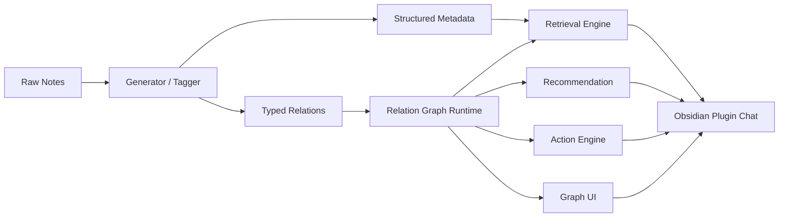

## Project Snapshot

| Item | Summary |
|------|---------|
| Problem | 기록은 쌓이지만 구조와 다음 행동은 자동으로 생기지 않았고, 일반적인 RAG만으로는 현재 노트 기준의 흐름을 설명하기 어려웠습니다. |
| Role | FastAPI 백엔드, Obsidian Plugin 메인 클라이언트, relation-aware retrieval, recommendation/action/graph 레이어, Streamlit 운영 콘솔, 테스트와 문서화를 직접 구현했습니다. |
| Stack | Python 3.12, FastAPI, Pydantic, TypeScript, Obsidian Plugin API, ChromaDB, BM25, RRF, Ollama, OpenAI |
| Flow | Obsidian Plugin 또는 Streamlit Ops -> FastAPI -> AgenticFlow -> Hybrid Retrieval + Relation Expansion + Rerank -> Recommendation / Action -> LLM -> NDJSON Streaming |
| Outcome | 로컬 RAG를 별도 콘솔 데모에서 Obsidian 안의 in-note workspace로 옮기고, relation chain을 검색, 추천, 액션, 그래프 설명으로 재사용하는 구조를 만들었습니다. |

  <strong>한 줄 요약</strong>
  
Obsidian RAG는 단순히 Obsidian에 챗봇을 붙인 프로젝트가 아니라, 기록을 구조화하고 관계를 만들고, 그 관계를 검색, 추천, 액션, 그래프 UI로 다시 연결한 로컬 지식 워크스페이스입니다.

## 1. 왜 만들었는가

이 프로젝트를 시작한 이유는 단순했습니다. Obsidian에는 기록이 계속 쌓이는데, 그 기록이 자동으로 구조가 되거나 다음 행동으로 이어지지는 않았습니다.

일반적인 RAG로는 문서를 찾아 답변을 만들 수는 있어도, 현재 읽는 노트를 기준으로 어떤 구현 문서가 이어지고 어떤 리뷰가 연결되며 무엇을 바로 실행해야 하는지는 설명하기 어려웠습니다. 그래서 이 프로젝트는 "Obsidian에 챗봇을 붙인다"가 아니라, 기록을 구조화하고 관계 기반으로 다시 탐색하는 작업형 워크스페이스를 만드는 문제로 정의했습니다.

- 기록은 남지만 구조와 다음 행동은 자동으로 생기지 않음
- 일반적인 RAG는 관계 구조를 이해하지 못하면 검색이 평면적임
- 검색 결과가 행동으로 이어지지 않으면 개인 지식 시스템으로서 효용이 낮음

<figure class="project-media-card">
  
  <figcaption>V1 Standalone RAG Console. 검색과 응답 실험은 가능했지만, 실제 Obsidian 작업 문맥 안으로 들어오지는 못했던 초기 화면입니다.</figcaption>
</figure>

## 2. 설계 철학

핵심은 문서를 단순 텍스트 청크가 아니라 역할과 관계를 가진 노드로 다시 해석하는 것이었습니다. 이 프로젝트는 retrieval 품질만 올리는 방향보다, relation chain을 recommendation과 action으로 연결하는 쪽에 더 무게를 두고 설계했습니다.

### 2-1. Structured-first note understanding

문서를 `note_type_auto` 와 `doc_role_auto` 로 나눠, "이 문서가 어떤 형식인가"와 "사고 흐름에서 어떤 역할인가"를 동시에 해석했습니다.

- `project-note + overview`
- `code-note + implementation`
- `review-note + review`
- `action-note + next_action`

이 조합 덕분에 retrieval과 recommendation이 단순 유사도 검색이 아니라 문서 흐름을 읽는 방향으로 바뀌었습니다.

### 2-2. Explainable typed relation schema

관련 문서를 단순 "비슷한 문서" 목록으로 두지 않고 `implements`, `review_of`, `next_action_for`, `decision_for`, `follow_up` 같은 typed relation으로 승격했습니다.

relation 생성에는 다음 신호를 함께 사용했습니다.

- explicit wikilink
- related files / backlink
- same project / same root domain
- shared semantic tags / section keys / signal tokens
- `note_type_auto`, `doc_role_auto`

즉 relation은 임베딩 유사도 하나가 아니라, 문서 역할과 문맥을 함께 반영한 설명 가능한 연결입니다.

### 2-3. Relation chain runtime

Phase 2에서는 relation metadata를 실제 런타임 관계망으로 승격했습니다.

- adjacency 구성
- 1-hop / 2-hop traversal
- relation path scoring
- relation path explanation

이 런타임은 retrieval source expansion, follow-up recommendation, action generation, graph panel에서 공통 인프라로 재사용됩니다.

### 2-4. Recommendation을 action-ready payload로 확장

추천은 "관련 문서 몇 개"를 보여주는 데서 멈추지 않고, `recommendation_kind`, `priority_band`, `action_prompt`, `action_title`, `relation_path_text`, `hop_count` 같은 필드를 가진 payload로 확장했습니다.

예를 들어 다음 분류를 다룹니다.

- `next_step`
- `implementation`
- `review`
- `decision`
- `plan`
- `context`

이 구조 덕분에 recommendation payload는 추천 카드이면서, action engine이 바로 재사용할 수 있는 입력이 됩니다.

## Architecture

## 3. V1 -> V2 진화

V1에서는 로컬 RAG 파이프라인이 실제로 동작하는지, Streamlit UI에서 retrieval과 응답 흐름을 안정적으로 정리할 수 있는지를 검증했습니다. V2에서는 그 흐름을 Obsidian 안으로 가져오면서 relation 기반 후속 탐색까지 확장했습니다.

  <figure class="project-media-card">
    
    <figcaption>V1. Standalone chat + 운영 콘솔 중심 구조</figcaption>
  </figure>
  <figure class="project-media-card">
    
    <figcaption>V2. 현재 노트를 중심으로 검색, 추천, 액션이 이어지는 in-note workspace</figcaption>
  </figure>

| 항목 | V1 | V2 |
|---|---|---|
| 메인 UI | Streamlit | Obsidian Plugin |
| 중심 기능 | 채팅 + 운영 콘솔 | 현재 노트 기반 질의 + workflow tools |
| 검색 방식 | hybrid retrieval 중심 | relation-aware retrieval |
| 결과 활용 | 답변 중심 | recommendation / action / graph 연결 |
| 제품 성격 | 실험용 로컬 RAG 콘솔 | 작업형 지식 워크스페이스 |

## 4. 무엇을 실제로 구현했는가

- Obsidian 플러그인을 메인 클라이언트로 두고 현재 노트, 링크, 폴더, 태그, 백링크 문맥을 함께 전달하도록 구성했습니다.
- `/api/chat/obsidian/stream` 을 통해 일반 채팅과 구분된 Obsidian 전용 질의 흐름을 구현했습니다.
- typed relation과 related file 정보를 활용해 1-hop, 2-hop 확장을 수행하는 relation-aware retrieval을 추가했습니다.
- Generator, Tagger, Ingest를 개별 스트리밍 API로 분리해 대화 외 작업도 동일한 인프라로 처리하도록 설계했습니다.
- recommendation layer를 action-ready payload로 바꿔 `resume_next_step`, `continue_implementation`, `request_review`, `request_result`, `request_evidence` 같은 action engine 흐름으로 연결했습니다.
- graph layer는 full canvas graph보다, 현재 질문에 사용된 relation path를 설명하는 lightweight panel로 설계했습니다.
- Streamlit은 메인 UI가 아니라 운영 콘솔과 fallback UI로 재정의했고, `start_rag.bat` 와 health check 흐름을 보강해 로컬 환경에서 재기동과 재사용이 가능하도록 정리했습니다.

## 5. 결과 화면과 검증

결과적으로 이 프로젝트는 "답변형 챗봇"보다 "검색 결과를 추천, 액션, 그래프 설명으로 연결한 Obsidian 워크스페이스"로 설명하는 편이 정확해졌습니다. 현재 노트를 기준으로 `Retrieved Sources`, `Follow-up Notes`, `Suggested Actions`, `Relation Graph`가 같은 흐름 안에서 이어지도록 제품형 구조를 맞췄습니다.

  

    <strong>Phase 2</strong>
    relation graph runtime accepted
  

  

    <strong>Recommendation</strong>
    payload parity 6/6
  

  

    <strong>Action Engine</strong>
    payload parity 4/4
  

  

    <strong>Regression</strong>
    19 tests passed
  

| Validation Item | Status | Meaning |
|---|---|---|
| Relation Graph Runtime | Accepted | relation metadata를 실제 런타임 그래프로 승격하고 path explanation까지 연결 |
| Recommendation Payload | 6/6 parity | 추천 결과가 source, relation path, 우선순위 정보를 유지한 채 일관되게 재사용됨 |
| Action Engine | 4/4 parity | recommendation이 실제 실행 가능한 action unit으로 안정적으로 전환됨 |
| Regression / Build | 19 passed | 기능 추가 이후에도 핵심 흐름이 깨지지 않도록 회귀 검증을 유지 |

## Demo Preview



  <video controls autoplay loop muted playsinline preload="metadata" poster="{{ page.demo_video_poster | relative_url }}" style="width:100%; border-radius:12px;">
    <source src="{{ page.demo_video_path | relative_url }}" type="video/mp4">
  </video>


> MP4 자리입니다. 데모 영상을 `assets/videos/obsidian-rag-v2-chat-demo.mp4` 로 넣고, 이 문서 front matter의 `demo_video_path` 값만 채우면 바로 노출됩니다.

질문 예시:
- 현재 노트 기준으로 다음 액션과 구현 흐름을 같이 보여줘.
- 이 노트와 직접 연결된 구현 노트, 리뷰 노트, 다음 액션 노트를 나눠서 보여줘.
- architecture -> implementation -> review -> next_action 흐름으로 관련 노트 체인을 찾아줘.


## 6. 운영 워크플로우 화면

V2는 채팅만 좋아진 버전이 아니라, 생성, 태깅, 인덱싱, 로그 확인까지 같은 로컬 시스템 안에서 다루는 워크플로우 확장 버전입니다.

  <figure class="project-media-card">
    
    <figcaption>Generator. 폴더 선택, 출력 경로, 모델, 패턴 세트를 조합해 생성 작업을 실행합니다.</figcaption>
  </figure>
  <figure class="project-media-card">
    
    <figcaption>Tagger. frontmatter와 vault 인덱스를 갱신해 구조화 품질을 유지합니다.</figcaption>
  </figure>
  <figure class="project-media-card">
    
    <figcaption>Ingest. 프로젝트 범위와 청킹 정책을 제어하면서 인덱스를 재구성합니다.</figcaption>
  </figure>
  <figure class="project-media-card">
    
    <figcaption>Logs. 실행 결과를 탭별 로그로 분리해 운영 흐름과 장애 지점을 확인합니다.</figcaption>
  </figure>

## 7. 직접 구현한 범위

이 프로젝트에서 제가 직접 맡은 범위는 아래와 같습니다.

- FastAPI 백엔드 설계 및 구현
- Obsidian Plugin 메인 클라이언트
- Streamlit 운영 콘솔과 fallback UI
- taxonomy / relation schema / relation runtime 설계
- recommendation / action / graph UI 연결
- Generator / Tagger / Ingest 스트리밍 워크플로우
- 테스트, probe, 문서화, 실행 스크립트 정리

채용 관점에서 중요한 포인트는, 모델 하나를 붙인 것이 아니라 문제 정의, 구조 설계, 인터페이스, 운영 도구, 검증까지 하나의 시스템으로 끝까지 묶었다는 점입니다.

## 8. 트레이드오프와 다음 단계

### 왜 full graph product보다 lightweight graph panel부터 만들었는가

처음부터 예쁜 전체 그래프를 만드는 것보다, 실제 질문에서 사용된 relation path를 source, recommendation, action과 함께 설명하는 편이 더 중요하다고 판단했습니다. 즉 그래프를 시각 장식이 아니라 runtime explanation infrastructure로 다루는 쪽을 우선했습니다.

### 현재 상태와 다음 단계

- 현재 상태: relation runtime, recommendation, action, graph UI까지 1차 수용 완료
- 다음 우선순위: Retrieval v2로 검색 품질과 relation 활용 기준 보강
- 남은 큰 축: Memory Layer, Graph Layer 제품화

프로젝트 저장소의 `README.md` 기준으로 현재 `main` 브랜치 구현은 V2입니다. 즉 이 페이지가 현재 코드베이스와 가장 가까운 버전이고, [Obsidian RAG V1]({{ '/portfolio/obsidian-rag/' | relative_url }}) 은 초기 아키텍처와 Streamlit 중심 워크플로우를 보여주는 아카이브에 가깝습니다.
