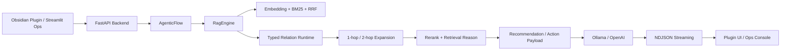

## Project Snapshot

| Item | Summary |
|------|---------|
| Problem | Streamlit 중심 V1만으로는 실제 Obsidian 작업 문맥과 연결이 약했고, 노트 관계를 활용하는 검색과 다음 행동 추천이 부족했습니다. |
| Role | FastAPI 백엔드, Obsidian Plugin 메인 클라이언트, relation-aware retrieval, recommendation/action/graph 레이어, Streamlit 운영 콘솔, 테스트와 문서화를 직접 구현했습니다. |
| Stack | Python 3.12, FastAPI, Pydantic, TypeScript, Obsidian Plugin API, ChromaDB, BM25, RRF, Ollama, OpenAI |
| Flow | Obsidian Plugin 또는 Streamlit Ops -> FastAPI -> AgenticFlow -> Hybrid Retrieval + Relation Expansion + Rerank -> Recommendation / Action -> LLM -> NDJSON Streaming |
| Outcome | 로컬 RAG를 별도 데모에서 실제 Obsidian 작업 흐름 안으로 옮기고, 검색 결과를 다음 행동으로 이어지는 지식 워크스페이스로 확장했습니다. |

## Architecture

## 1. 프로젝트 개요

`Obsidian RAG V2`는 Obsidian 안에서 현재 노트 문맥, 관련 문서 검색, 생성/태깅/인덱싱 워크플로우를 함께 다루는 로컬 지식 워크스페이스입니다.

V1이 별도 Streamlit 콘솔에서 로컬 RAG를 구현했다면, V2는 실제 작업이 일어나는 Obsidian 안으로 검색과 워크플로우를 끌어오는 데 초점을 맞췄습니다. 현재 저장소의 `README.md` 와 `README_v2.md` 기준으로 보면, 이 버전은 단순 챗봇이 아니라 기록 구조화, 관계 탐색, 후속 행동 추천까지 묶는 쪽으로 확장됐습니다.

## 2. 왜 V2가 필요했는가

V1은 기술 실험과 파이프라인 정리에 의미가 있었지만, 실제 사용 흐름에는 한계가 있었습니다.

- 작업 중인 현재 노트 문맥을 질문과 자연스럽게 연결하기 어려웠습니다.
- 검색 결과가 왜 선택됐는지 UI에서 빠르게 설명하기 어려웠습니다.
- Generator, Tagger, Ingest 같은 운영 작업이 별도 콘솔 안에 갇혀 있었습니다.
- 노트 사이 관계 정보가 있어도 검색 단계에서는 충분히 활용하지 못했습니다.

이 문제를 줄이기 위해, V2에서는 클라이언트 구조, relation runtime, 운영 인터페이스를 함께 다시 설계했습니다.

## 3. 어떤 지식과 아이디어를 적용했는가

### 3-1. Structured-first note understanding

문서를 단순 텍스트 청크로만 보지 않고, `note_type_auto` 와 `doc_role_auto` 를 분리해 문서 형식과 사고 흐름상 역할을 함께 모델링했습니다.

예를 들어:

- `project-note + overview`
- `code-note + implementation`
- `review-note + review`
- `action-note + next_action`

같은 조합을 통해 retrieval과 recommendation이 단순 유사도 검색을 넘어 문서 흐름을 이해하도록 설계했습니다.

### 3-2. Explainable typed relation schema

관련 문서를 단순 "비슷한 문서" 목록으로 두지 않고 `implements`, `review_of`, `next_action_for`, `decision_for`, `follow_up` 같은 typed relation으로 승격했습니다.

relation 생성에는 다음 신호를 함께 사용했습니다.

- explicit wikilink
- related files / backlink
- same project / same root domain
- shared semantic tags / section keys / signal tokens
- `note_type_auto`, `doc_role_auto`

즉 relation은 임베딩 유사도 하나가 아니라, 문서 역할과 문맥을 함께 반영한 설명 가능한 연결입니다.

### 3-3. Relation chain runtime

Phase 2에서는 relation metadata를 실제 런타임 관계망으로 승격했습니다.

- adjacency 구성
- 1-hop / 2-hop traversal
- relation path scoring
- relation path explanation

이 런타임은 retrieval source expansion, follow-up recommendation, action generation, graph-like panel에서 공통 인프라로 재사용됩니다.

### 3-4. Recommendation을 action-ready payload로 확장

추천은 "관련 문서 몇 개"를 보여주는 데서 멈추지 않고, `recommendation_kind`, `priority_band`, `action_prompt`, `action_title`, `relation_path_text`, `hop_count` 같은 필드를 가진 payload로 확장했습니다.

예를 들어:

- `next_step`
- `implementation`
- `review`
- `decision`
- `plan`
- `context`

이 구조 덕분에 추천 결과가 바로 다음 행동 카드와 연결될 수 있었습니다.

### 3-5. Action Engine과 lightweight graph panel

Action Engine v1은 추천 결과를 `resume_next_step`, `continue_implementation`, `request_review`, `request_result`, `request_evidence` 같은 행동 단위로 변환합니다.

Graph Layer는 full canvas graph보다, 실제 질문에서 사용된 relation path를 짧은 chain으로 보여주는 lightweight panel에 가깝습니다. 목표는 복잡한 그래프 시각화가 아니라, "왜 이 노트가 연결됐는가"를 읽고 바로 탐색하게 만드는 것이었습니다.

## 4. 무엇을 만들었는가

- Obsidian 플러그인을 메인 클라이언트로 두고 현재 노트, 링크, 폴더, 태그, 백링크 문맥을 함께 전달하도록 구성했습니다.
- `/api/chat/obsidian/stream` 을 통해 일반 채팅과 구분된 Obsidian 전용 질의 흐름을 구현했습니다.
- typed relation과 related file 정보를 활용해 1-hop, 2-hop 확장을 수행하는 relation-aware retrieval을 추가했습니다.
- Generator, Tagger, Ingest를 개별 스트리밍 API로 분리해 대화 외 작업도 동일한 인프라로 처리하도록 설계했습니다.
- Streamlit은 메인 UI가 아니라 운영 콘솔과 fallback UI로 재정의했습니다.
- `start_rag.bat` 와 health check 흐름을 보강해 로컬 환경에서 재기동과 재사용이 가능하도록 정리했습니다.

## 5. 화면 예시

### 5-1. Obsidian Plugin + Chat

Obsidian 안에서 현재 노트 문맥과 함께 질문하고, 우측 패널에서 로컬 에이전트 흐름을 바로 다루는 구조입니다.

## Demo Preview



  <video controls autoplay loop muted playsinline preload="metadata" poster="{{ page.demo_video_poster | relative_url }}" style="width:100%; border-radius:12px;">
    <source src="{{ page.demo_video_path | relative_url }}" type="video/mp4">
  </video>


> MP4 자리입니다. 데모 영상을 `assets/videos/obsidian-rag-v2-chat-demo.mp4` 로 넣고, 이 문서 front matter의 `demo_video_path` 값만 채우면 바로 노출됩니다.

질문 예시:
- 현재 문서를 기준으로 지금 바로 진행할 다음 액션 3개만 우선순위 순서로 정리해줘.
- 왜 이 문서들이 같이 검색됐는지 relation path와 함께 설명해줘.
- 이 주제와 직접 연결된 구현 문서, 리뷰 문서, 다음 액션 문서를 묶어서 보여줘.


### 5-2. Generator

폴더 선택, 출력 경로, 모델, 패턴 세트를 조합해 생성 작업을 실행하는 패널입니다.

### 5-3. Tagger

선택 범위의 frontmatter를 갱신하고 vault 전체 인덱스를 다시 맞추는 태깅 워크플로우 화면입니다.

### 5-4. Ingest

프로젝트 범위, 레이어, 청킹 정책을 제어하면서 인덱스를 재구성하는 운영 화면입니다.

### 5-5. Logs

워크플로우 실행 결과를 탭별 로그로 확인할 수 있도록 분리한 운영 화면입니다.

## 6. 이 버전에서 보여주고 싶은 역량

- 노트 도메인에 맞춘 제품형 문제 정의와 워크플로우 설계
- taxonomy / relation schema / runtime graph 같은 구조 설계 역량
- 백엔드 API와 Obsidian Plugin 간 인터페이스 설계 능력
- relation graph를 활용한 retrieval 품질 개선
- recommendation / action / graph UI를 하나의 payload 체계로 연결하는 능력
- 대화형 기능과 운영 도구를 하나의 로컬 시스템으로 통합하는 능력

## 7. 현재 기준 위치

프로젝트 저장소의 `README.md` 기준으로 현재 `main` 브랜치 구현은 V2입니다. 즉, 이 페이지가 현재 코드베이스와 가장 가까운 버전이고, [Obsidian RAG V1]({{ '/portfolio/obsidian-rag/' | relative_url }}) 은 초기 아키텍처와 Streamlit 중심 워크플로우를 보여주는 아카이브에 가깝습니다.
